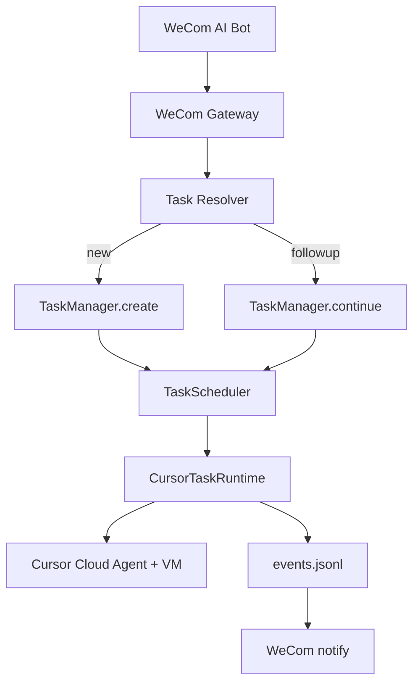

# Cloud Task Manager + 企微 Bot

从当前已落地的 `TaskManager` / `aafe task` 出发，说明如何启动 Cloud Task Manager，以及如何用企微 AI Bot 创建一个隔离的 Cursor Cloud Agent。

本文是**实施清单**，不是架构随笔。架构背景见：

- [UPDATE-CONTEXT.md](./UPDATE-CONTEXT.md)：AAFE = Agent Manager，Task 隔离
- [UPDATE-CURSOR-CLOUD.md](./UPDATE-CURSOR-CLOUD.md)：一个 Task 对应一个 Cursor Cloud Agent
- [AGENTS.SETUP.md](./AGENTS.SETUP.md)：`aafe run --agent=cursor` 与 `aafe task` 的配置

---

## 目录

- [1. 目标与边界](#1-目标与边界)
- [2. 已落地 / 未落地](#2-已落地--未落地)
- [3. 启动 Cloud Task Manager](#3-启动-cloud-task-manager)
- [4. 第一版 Agent 定义](#4-第一版-agent-定义)
- [5. 企微调用链路](#5-企微调用链路)
- [6. 分阶段实施](#6-分阶段实施)
- [7. 与现有入口的关系](#7-与现有入口的关系)
- [8. 非目标与风险](#8-非目标与风险)

---

## 1. 目标与边界

一句话：企微发需求 → AAFE 立即回 Task ID → Cloud Task Manager 创建独立 Cursor Cloud Agent → 完成后企微通知。



边界：

- AAFE 不自己改代码；Cursor Cloud 是执行沙箱
- 一个企微会话可挂多个 Task Thread，禁止一个 Cursor Agent 串多个业务任务
- 第一版不做 pause、不做 Web UI、不做多仓库智能路由

---

## 2. 已落地 / 未落地

### 已落地

| 能力 | 位置 |
| --- | --- |
| `create / start / continue / cancel / recover` | `src/agent-platform/tasks/TaskManager.js` |
| 一 Task 一 Agent、多 Run、`Agent.getRun` 恢复 | `src/agent-platform/runtime/CursorTaskRuntime.js` |
| CLI | `aafe task create\|list\|status\|continue\|cancel\|recover`（`src/cli/tasks.js`） |
| 持久化 | `.aafe/tasks/<id>/{task.json,context.json,events.jsonl}` |
| `source` 字段 | `TaskStore` 已存；CLI 目前只写 `{ type }`，例如 `--source=wecom` |

### 未落地（后续实现）

- 企微 Gateway / 回调验签 / 异步回包
- 长驻进程：`aafe task` 跑完就 `manager.close()`，`recoverOnStart` 不会自动生效
- Task Resolver（同会话「继续刚才」vs 新任务）
- Event Bus → 企微推送
- `agent.manager.enabled` 只影响 `aafe init` / `aafe doctor`，不是 `aafe task` 的运行硬开关

当前本仓库默认仍是关闭态：`agent.enabled=false`、`mode=local`、`repository=null`、`manager.enabled=false`。

---

## 3. 启动 Cloud Task Manager

本节只列配置与检查单，**不改本仓库 `.aafe.config.json`**。对应 `src/cli/agentMode.js` 与 `aafe doctor` 约束。

### 3.1 目标配置

```json
{
  "agent": {
    "enabled": true,
    "provider": "cursor",
    "mode": "cloud",
    "model": "composer-2.5",
    "apiKeyEnv": "CURSOR_API_KEY",
    "apiKey": null,
    "repository": "owner/repo",
    "autoCreatePR": false,
    "skipReviewerRequest": true,
    "manager": {
      "enabled": true,
      "maxConcurrentTasks": 4,
      "output": ".aafe",
      "validateProjectRuntime": true,
      "recoverOnStart": true
    }
  }
}
```

等价 CLI（写入配置，不自动跑任务）：

```bash
export CURSOR_API_KEY="crsr_..."

aafe update --agent-mode=on \
  --agent-manager=on \
  --cursor-runtime=cloud \
  --cursor-model=composer-2.5 \
  --cursor-api-key-env=CURSOR_API_KEY
```

`repository` 必须另外写进 `agent.repository`，或每次命令带 `--repository=`。

### 3.2 检查单

1. `agent.mode` 必须是 `cloud`。`manager.enabled=true` 且 `mode!=cloud` 时，`aafe doctor` 报警：managed tasks never share a local workspace。
2. `agent.repository` 必填（`owner/repo` 或完整 git URL），否则 doctor 报警。
3. Key 只走环境变量。`apiKeyEnv` 是变量名（默认 `CURSOR_API_KEY`），不要把 Key 本身写进去。`apiKey` 保持 `null`。
4. Cloud clone 必须能读到**已被 Git 跟踪**的：
   - `.aafe.config.json`
   - `.ai-agent/skill-index.md`
   - `.ai-agent/project.md`
   - Cursor 指针（`.cursor/rules` / `.cursor/skills` 里指向 skill-index 与 `.ai-agent`）
   - SDD 开启时还要 SDD Skill 与对应指针
   校验逻辑见 `src/agent-platform/runtime/CloudProjectReadiness.js`。未跟踪或指针错误时 Task 会 `blocked`。
5. 进程模型：
   - `aafe task create --requirement=... --repository=...` 只适合联调；进程结束会 `manager.close()`
   - 企微 Bot 需要长驻 Server；启动时调用 `TaskManager.initialize()`（内部 `recover()`）重连 `queued / planning / ready / running`

### 3.3 联调冒烟（P0）

```bash
export CURSOR_API_KEY="crsr_..."

aafe task create \
  --requirement="增加用户手机号搜索" \
  --repository=owner/repo \
  --source=wecom
```

通过标准：返回的 `task.json` 里出现 `cursor.agentId`，状态走到 `running` 或终态；失败时 `error` 可读，而不是卡在本机 HTTP 超时。

只建不跑：

```bash
aafe task create --requirement="..." --repository=owner/repo --no-run
aafe task status <taskId>
```

---

## 4. 第一版 Agent 定义

「生成一个 Agent」不是再造一个 Cursor Agent，而是定义企微入口 Agent。Cursor Cloud Agent 由 TaskManager 按 Task 创建。

| 角色 | 实现 | 职责 |
| --- | --- | --- |
| WeCom Bot Agent | 新增 Gateway（未实现） | 收消息、验签、立即回包、把结果推回企微 |
| Task Manager | 已有 | 任务生命周期、隔离目录、调度 |
| Cursor Cloud Agent | SDK `Agent.create({ cloud })` | 每个 Task 一个，负责改代码 |

### 4.1 命令约定

| 用户说 | TaskManager | 说明 |
| --- | --- | --- |
| `@AAFE 做：<需求>` | `create` + `start` | `source.type=wecom` |
| `@AAFE 继续 Txxx：<补充>` | `continue` | 同一 Cursor Agent 新 Run |
| `@AAFE 状态 Txxx` | `status` | 读 `task.json` + scheduler |
| `@AAFE 取消 Txxx` | `cancel` | 取消队列或 `runtime.cancel` |
| `@AAFE 列表` | `list` | 当前用户未结束任务 |

第一版必须带显式 Task ID 才能「继续」；不猜测「刚才那个」。模糊指代留给 P2 Resolver。

### 4.2 `source` 目标形态

扩展现有 `task.source`，不另起存储：

```ts
source: {
  type: 'wecom',
  conversationId: string,
  messageId: string,
  userId: string,
  chatbotId?: string
}
```

`context.conversation.messages` 继续追加用户补充；`continue` 已经这样写。企微原文不要当 Cursor prompt 全文转发，先经 Task + Context Package。

---

## 5. 企微调用链路

P1 伪流程：

```text
企微回调 → 验签 → Resolver
  → TaskManager.create({ source: wecom, repository, requirement })
  → 立即回复「T001 已创建」
  → TaskManager.start（后台）
  → events.jsonl
  → 完成后主动推企微
```

不要：

```text
企微 HTTP 请求 → 等待 Cursor 20 分钟 → 再返回
```

要：

```text
企微 HTTP → 3 秒内 ACK（Task 已创建）
后台 start → stream → events.jsonl
完成后主动推：状态、改动文件、测试、PR / 错误
```

Gateway 只调 TaskManager，禁止直接 `Agent.create`。

---

## 6. 分阶段实施

### P0 配置与 CLI 冒烟

做什么：按第 3 节打开 cloud + manager 所需配置（在目标项目里改，不在本规划任务改本仓库默认值）；用 `aafe task create` 打通 Cursor Cloud。

验收：

- `aafe doctor` 不再报 `manager.enabled requires mode cloud` / `requires repository`
- `aafe task create --requirement=... --repository=... --source=wecom` 能创建并绑定 `cursor.agentId`
- `.aafe/tasks/<id>/` 有三件套；`aafe task recover` 能重排未结束任务

### P1 WeCom Gateway

做什么：企微智能机器人 / 应用回调；验签；解析 `@AAFE 做：`；调用 `TaskManager.create` + 异步 `start`。

验收：

- 非法签名拒绝
- 合法消息 3 秒内 ACK，正文含 Task ID
- 请求返回后 Cursor 仍在跑（看 `events.jsonl` 的 `cursor.run.started`）
- 不阻塞等 Cloud 跑完

### P2 Resolver + 回推

做什么：按 `conversationId` + 显式 Task ID 路由；订阅 `TaskManager.subscribe` 或扫 `events.jsonl`；完成 / 失败推企微。

验收：

- `@AAFE 继续 Txxx` 复用同一 `cursor.agentId`，新增 Run
- 未给 Task ID 且会话内有多个未结束任务 → 回问，不新建也不乱续
- 完成推送含：Task ID、状态、改动文件（若有）、PR（若有）、错误（若失败）

### P3 长驻与恢复

做什么：独立 Server（或 worker）持有一个 `TaskManager`；启动 `initialize()` / `recover()`；进程重启后用 `agentId + activeRunId` 调 `Agent.getRun`。

验收：

- 杀掉 Server 再拉起：`running` 且已有 `activeRunId` 的任务重连，而不是再 `Agent.create`
- 第一版单进程；文档写明多进程不共享 scheduler semaphore
- `aafe task` CLI 仍可用于运维，不替代长驻进程

---

## 7. 与现有入口的关系

| 入口 | 用途 |
| --- | --- |
| `aafe run --agent=cursor` | 一次性 local/cloud overlay，不给企微用 |
| `aafe task` | Cloud Task 联调与运维 |
| WeCom Bot | 生产入口，只调 TaskManager，不直接 `Agent.create` |

`aafe run` 不会自动创建 durable Task。企微路径也**不要**先 `aafe run` 再转 Task。

---

## 8. 非目标与风险

- 不把企微全文当 Cursor prompt；先经 Task + Context Package
- 不在 HTTP 请求里等 Cloud 跑完
- `autoCreatePR` 默认关，不替代 Task Spine 的 Commit / PR / TAPD 回填
- 多进程不共享 scheduler semaphore，第一版单进程 Server
- `agent.manager.enabled` 在实现 P3 之前仍只是 doctor / init 提示；长驻进程自己调用 `initialize()`
- 不要把 API Key 写进仓库或本文件
