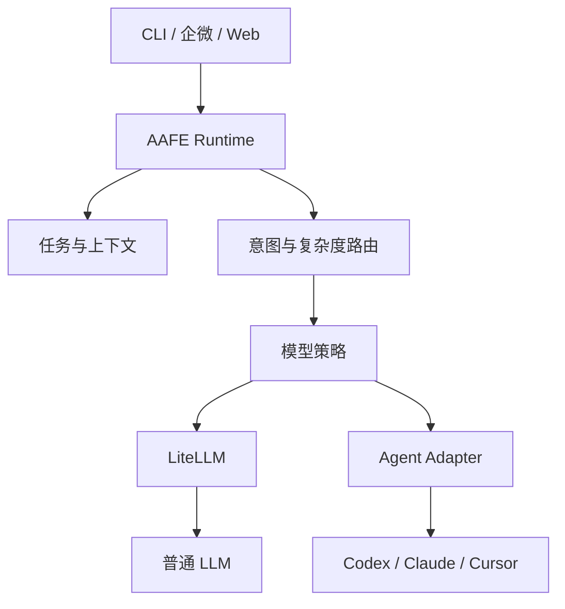

可以。建议不要一次性把完整多 Agent 平台全部做完，而是以当前 Cursor SDK 版本为基础，逐步抽离出供应商无关的 AAFE Agent Runtime。

最终目标：



下面按可直接开发的顺序落地。

# 一、总体实施阶段

| 阶段      | 目标                   |  建议周期 | 核心产物                      |
| ------- | -------------------- | ----: | ------------------------- |
| Phase 0 | 建立基线                 |  1～2天 | Token、成本、路由准确率基线          |
| Phase 1 | 抽离 Runtime           |  3～5天 | 统一任务、事件、执行器接口             |
| Phase 2 | 任务和上下文持久化            |  4～7天 | SQLite、Task Snapshot、会话恢复 |
| Phase 3 | 分层意图识别               |  5～8天 | 规则路由、语义路由、小模型兜底           |
| Phase 4 | 复杂度与模型适配             |  4～7天 | Model Policy Engine       |
| Phase 5 | LiteLLM 接入           |  2～4天 | 统一模型网关、降级、限额              |
| Phase 6 | Coding Agent Adapter | 5～10天 | Codex/Claude/Cursor 适配器   |
| Phase 7 | 上下文压缩与本地复用           |  5～8天 | 增量摘要、Repo Map、缓存          |
| Phase 8 | 工作流与安全控制             | 5～10天 | 状态机、审批、暂停恢复               |
| Phase 9 | 评测和动态优化              |    持续 | 路由评测集、成本质量闭环              |

先做 Phase 0～4，就能明显改善意图识别和 Token 消耗；后面的多 Agent 接入不应阻塞第一版上线。

---

# 二、Phase 0：先建立现有版本基线

在重构前记录当前 Cursor SDK 版本真实数据，否则后面无法判断是否优化有效。

## 2.1 记录每次请求

```ts
interface InvocationMetric {
  traceId: string;
  taskId?: string;
  provider: string;
  model: string;

  inputTokens: number;
  outputTokens: number;
  cachedTokens?: number;

  latencyMs: number;
  firstTokenMs?: number;
  estimatedCost: number;

  route?: string;
  routeConfidence?: number;
  routeCorrected?: boolean;

  success: boolean;
  errorCode?: string;
  createdAt: string;
}
```

## 2.2 准备第一批评测数据

从历史请求中人工整理至少100条，建议达到300条。

```json
{
  "input": "继续把刚才登录问题修复掉",
  "expected": {
    "relation": "continue",
    "domain": "coding",
    "action": "implement",
    "complexity": "L2"
  }
}
```

至少包含：

* 新任务
* 继续已有任务
* 补充条件
* 修改需求
* 取消任务
* 查询进度
* 简单问答
* 单文件修改
* 多文件功能
* Bug诊断
* 架构分析
* 测试
* 部署
* 高风险命令
* 无法判断的输入

## 2.3 基线指标

必须记录：

```text
意图分类准确率
任务归属准确率
模型选择合理率
单请求平均输入 Token
单任务总 Token
平均响应时间
任务成功率
人工纠正率
```

第一阶段目标可定为：

| 指标            |    第一版目标 |
| ------------- | -------: |
| 一级意图准确率       |    ≥ 90% |
| 已有任务关联准确率     |    ≥ 95% |
| 平均输入 Token 降低 |    ≥ 50% |
| 简单任务强模型调用率    |    ≤ 10% |
| 无效重复文件读取      | 降低 ≥ 60% |

---

# 三、Phase 1：建立 AAFE Runtime 核心骨架

不要先接 LangGraph，也不要先接更多模型。先把当前 Cursor SDK 从业务逻辑中隔离出来。

## 3.1 推荐目录结构

```text
packages/
├── runtime/
│   ├── task/
│   ├── session/
│   ├── context/
│   ├── routing/
│   ├── policy/
│   ├── workflow/
│   ├── executor/
│   ├── events/
│   └── telemetry/
├── storage-sqlite/
├── model-gateway/
├── adapter-cursor/
├── adapter-codex/
├── adapter-claude-code/
├── adapter-openai-compatible/
├── context-codebase/
└── cli/

config/
├── agents.json
├── models.json
├── routing.json
├── context.json
└── permissions.json
```

如果当前项目不适合 monorepo，先按模块目录组织，接口保持一致即可。

## 3.2 定义统一请求

```ts
export interface AgentRequest {
  requestId: string;
  conversationId: string;
  userId: string;

  message: string;

  source: "cli" | "wecom" | "web" | "api";

  replyTo?: {
    messageId?: string;
    taskId?: string;
  };

  workspace?: {
    root: string;
    repository?: string;
    branch?: string;
  };

  attachments?: AttachmentRef[];
  metadata?: Record<string, unknown>;
}
```

## 3.3 定义统一执行输入

```ts
export interface ExecutionInput {
  executionId: string;
  taskId: string;

  instruction: string;
  taskSnapshot: TaskSnapshot;

  contextItems: ContextItem[];

  workspace?: WorkspaceRef;

  capabilities: Capability[];

  limits: {
    maxInputTokens: number;
    maxOutputTokens: number;
    maxIterations: number;
    timeoutMs: number;
    maxCost?: number;
  };
}
```

## 3.4 定义统一执行器

```ts
export interface ExecutorAdapter {
  readonly id: string;
  readonly type: "llm" | "coding-agent" | "workflow";

  getCapabilities(): Promise<ExecutorCapabilities>;

  estimate(input: ExecutionInput): Promise<ExecutionEstimate>;

  execute(input: ExecutionInput): AsyncIterable<ExecutionEvent>;

  resume?(
    executionId: string,
    input: ExecutionContinuation,
  ): AsyncIterable<ExecutionEvent>;

  cancel(executionId: string): Promise<void>;
}
```

## 3.5 定义统一事件

```ts
export type ExecutionEvent =
  | { type: "execution.started"; executionId: string }
  | { type: "thinking.delta"; content: string }
  | { type: "message.delta"; content: string }
  | { type: "tool.started"; tool: string; callId: string }
  | { type: "tool.completed"; callId: string; result: unknown }
  | { type: "file.changed"; path: string }
  | { type: "approval.required"; approval: ApprovalRequest }
  | { type: "usage.updated"; usage: TokenUsage }
  | { type: "execution.completed"; result: ExecutionResult }
  | { type: "execution.failed"; error: ExecutionError }
  | { type: "execution.cancelled" };
```

UI、企微和 CLI 只能消费统一事件，不能感知底层是 Cursor、Codex 还是 Claude。

## 3.6 第一阶段改造方式

把现有 Cursor SDK 包起来：

```ts
class CursorAdapter implements ExecutorAdapter {
  // 内部保留现有 Cursor SDK 调用
}
```

此时不改变 Cursor 行为，只改变调用边界。

### 验收标准

* 原有 Cursor 功能继续运行。
* Runtime 不再直接 import Cursor SDK。
* 替换执行器不需要修改任务逻辑。
* UI 不再解析 Cursor 私有响应格式。

---

# 四、Phase 2：SQLite 任务和上下文持久化

本地机器人必须首先有可靠的任务模型，不能把任务状态寄托在聊天上下文中。

## 4.1 核心数据表

```sql
CREATE TABLE conversations (
  id TEXT PRIMARY KEY,
  source TEXT NOT NULL,
  external_id TEXT,
  user_id TEXT NOT NULL,
  created_at INTEGER NOT NULL,
  updated_at INTEGER NOT NULL
);

CREATE TABLE tasks (
  id TEXT PRIMARY KEY,
  conversation_id TEXT NOT NULL,
  parent_task_id TEXT,
  title TEXT NOT NULL,
  status TEXT NOT NULL,
  intent TEXT,
  complexity TEXT,
  risk_level TEXT,
  active_execution_id TEXT,
  created_at INTEGER NOT NULL,
  updated_at INTEGER NOT NULL
);

CREATE TABLE messages (
  id TEXT PRIMARY KEY,
  conversation_id TEXT NOT NULL,
  task_id TEXT,
  role TEXT NOT NULL,
  content TEXT NOT NULL,
  token_count INTEGER,
  created_at INTEGER NOT NULL
);

CREATE TABLE task_snapshots (
  id TEXT PRIMARY KEY,
  task_id TEXT NOT NULL,
  version INTEGER NOT NULL,
  snapshot_json TEXT NOT NULL,
  created_at INTEGER NOT NULL
);

CREATE TABLE executions (
  id TEXT PRIMARY KEY,
  task_id TEXT NOT NULL,
  executor_id TEXT NOT NULL,
  model_id TEXT,
  status TEXT NOT NULL,
  input_tokens INTEGER DEFAULT 0,
  output_tokens INTEGER DEFAULT 0,
  estimated_cost REAL DEFAULT 0,
  started_at INTEGER,
  finished_at INTEGER,
  error_json TEXT
);

CREATE TABLE execution_events (
  id INTEGER PRIMARY KEY AUTOINCREMENT,
  execution_id TEXT NOT NULL,
  event_type TEXT NOT NULL,
  event_json TEXT NOT NULL,
  created_at INTEGER NOT NULL
);

CREATE TABLE context_artifacts (
  id TEXT PRIMARY KEY,
  task_id TEXT,
  artifact_type TEXT NOT NULL,
  source_key TEXT NOT NULL,
  content_hash TEXT NOT NULL,
  content TEXT NOT NULL,
  metadata_json TEXT,
  created_at INTEGER NOT NULL,
  updated_at INTEGER NOT NULL
);

CREATE TABLE route_decisions (
  id TEXT PRIMARY KEY,
  request_id TEXT NOT NULL,
  task_id TEXT,
  route_json TEXT NOT NULL,
  router_stage TEXT NOT NULL,
  corrected_json TEXT,
  created_at INTEGER NOT NULL
);
```

## 4.2 Task Snapshot

每个任务维护结构化快照：

```ts
interface TaskSnapshot {
  taskId: string;
  version: number;

  goal: string;
  status: "pending" | "running" | "blocked" | "completed" | "cancelled";

  requirements: string[];
  constraints: string[];
  acceptanceCriteria: string[];

  decisions: Array<{
    decision: string;
    reason?: string;
  }>;

  completedSteps: string[];
  pendingSteps: string[];
  blockers: string[];

  touchedFiles: string[];
  relevantFiles: string[];

  lastResult?: string;
  updatedAt: string;
}
```

## 4.3 Snapshot 更新原则

不要每轮都重新总结整个会话。

只在以下情况更新：

* 用户改变目标或约束
* 完成一个工作流步骤
* 修改文件
* 得出重要诊断
* 任务进入 blocked/completed
* 消息窗口即将超过限制

更新方式使用增量 Patch：

```json
{
  "appendConstraints": [
    "不能升级Vue版本"
  ],
  "appendCompletedSteps": [
    "确认问题由路由守卫引起"
  ],
  "appendTouchedFiles": [
    "src/router/index.ts"
  ],
  "removePendingSteps": [
    "检查路由守卫"
  ]
}
```

### 验收标准

* 进程重启后能够恢复任务。
* 无须完整聊天历史即可继续执行。
* 每个消息可以追踪到所属任务。
* 每次执行可以追踪 Token、模型、状态和结果。

---

# 五、Phase 3：实现分层意图识别

这是最重要的一步。

## 5.1 路由结果 Schema

```ts
interface RouteDecision {
  relation: "new" | "continue" | "supplement" | "clarify" | "cancel";
  domain:
    | "chat"
    | "coding"
    | "analysis"
    | "research"
    | "testing"
    | "document"
    | "operation";
  action:
    | "answer"
    | "inspect"
    | "plan"
    | "implement"
    | "fix"
    | "review"
    | "test"
    | "deploy"
    | "cancel";
  complexity: "L0" | "L1" | "L2" | "L3";
  risk: "low" | "medium" | "high";
  targetTaskId?: string;
  confidence: number;
  reasons: string[];
  requiredCapabilities: Capability[];
}
```

## 5.2 Stage 1：协议和引用识别

优先处理明确证据：

```ts
function resolveExplicitRelation(
  request: AgentRequest,
): Partial<RouteDecision> | null {
  if (request.replyTo?.taskId) {
    return {
      relation: "continue",
      targetTaskId: request.replyTo.taskId,
      confidence: 1,
    };
  }

  if (/^\/new\b/.test(request.message)) {
    return { relation: "new", confidence: 1 };
  }

  if (/^\/cancel\b/.test(request.message)) {
    return { relation: "cancel", confidence: 1 };
  }

  return null;
}
```

企微场景中优先级：

```text
显式 taskId
> 回复消息绑定的 taskId
> 当前用户在当前会话的唯一活跃任务
> 语义相似任务
> 创建新任务或请求澄清
```

## 5.3 Stage 2：规则路由

配置文件：

```json
{
  "routes": [
    {
      "id": "task.cancel",
      "priority": 100,
      "patterns": [
        "^停止",
        "^终止",
        "取消.*任务"
      ],
      "result": {
        "relation": "cancel",
        "action": "cancel",
        "risk": "low"
      }
    },
    {
      "id": "coding.review",
      "priority": 80,
      "patterns": [
        "代码审查",
        "review.*代码",
        "检查.*diff"
      ],
      "result": {
        "domain": "coding",
        "action": "review"
      }
    }
  ]
}
```

规则只处理高确定性输入，禁止堆积成巨大关键词库。

## 5.4 Stage 3：语义路由

每条 Route 配置20～50个真实表达：

```json
{
  "name": "coding.fix",
  "utterances": [
    "修复这个报错",
    "定位为什么页面白屏",
    "这个接口请求失败怎么解决",
    "帮我排查内存泄漏",
    "刚才修改后测试不通过"
  ]
}
```

执行过程：

```text
输入归一化
→ 本地 Embedding
→ 与 Route Centroid/样本匹配
→ 返回 topK
→ 应用每个 Route 独立阈值
```

结果：

```ts
interface SemanticRouteResult {
  route: string;
  score: number;
  candidates: Array<{
    route: string;
    score: number;
  }>;
}
```

初始阈值不要写死成统一的 `0.8`。根据评测数据为每条路由单独校准。

## 5.5 Stage 4：小模型兜底

只有以下情况调用小模型：

```text
规则未命中
且语义路由置信度不足
或前两名差距过小
或存在多个可能的活动任务
```

给小模型的内容只包含：

```text
用户当前消息
候选任务的精简快照
候选路由
输出 JSON Schema
```

不要发送完整聊天记录。

示例输入：

```json
{
  "message": "这个也需要加上重试",
  "candidateTasks": [
    {
      "id": "task-1",
      "goal": "实现登录接口",
      "lastAction": "增加超时处理"
    },
    {
      "id": "task-2",
      "goal": "部署Web服务",
      "lastAction": "配置Nginx"
    }
  ],
  "candidateRoutes": [
    "coding.implement",
    "operation.deploy"
  ]
}
```

## 5.6 低置信度处理

```ts
if (decision.confidence < 0.6) {
  return requestClarification();
}

if (
  decision.relation === "continue" &&
  !decision.targetTaskId
) {
  return requestTaskSelection();
}
```

不要为了“自动化”强行猜测任务归属。

---

# 六、Phase 4：实现复杂度评估

意图决定做什么，复杂度决定用什么能力执行，两者必须分开。

## 6.1 复杂度输入特征

```ts
interface ComplexityFeatures {
  estimatedFiles: number;
  estimatedModules: number;

  requiresRepositorySearch: boolean;
  requiresPlanning: boolean;
  requiresTools: boolean;
  requiresCodeExecution: boolean;
  requiresExternalResearch: boolean;

  crossModule: boolean;
  crossRepository: boolean;

  contextTokenEstimate: number;
  ambiguity: number;
  destructiveRisk: boolean;
}
```

## 6.2 第一版使用规则评分

```ts
function calculateComplexity(
  features: ComplexityFeatures,
): ComplexityLevel {
  let score = 0;

  score += Math.min(features.estimatedFiles, 10);
  score += Math.min(features.estimatedModules * 2, 10);
  score += features.requiresRepositorySearch ? 2 : 0;
  score += features.requiresPlanning ? 3 : 0;
  score += features.requiresTools ? 2 : 0;
  score += features.requiresCodeExecution ? 2 : 0;
  score += features.requiresExternalResearch ? 2 : 0;
  score += features.crossModule ? 4 : 0;
  score += features.crossRepository ? 6 : 0;
  score += features.destructiveRisk ? 8 : 0;
  score += Math.round(features.ambiguity * 4);

  if (score <= 3) return "L0";
  if (score <= 8) return "L1";
  if (score <= 16) return "L2";
  return "L3";
}
```

## 6.3 等级定义

### L0

* 简单问答
* 文本转换
* 命令解释
* 明确的单点查询

处理方式：

```text
直接回答
不启动完整 Agent
不加载仓库
快速模型
```

### L1

* 单文件修改
* 简单代码解释
* 明确位置的小型 Bug
* 单元测试补充

处理方式：

```text
快速 Coding 模型
有限工具调用
最多读取少量文件
```

### L2

* 多文件功能
* 需要定位的 Bug
* E2E 测试
* 模块级重构

处理方式：

```text
Planner
中高能力 Coding Agent
仓库检索
执行测试
```

### L3

* 架构设计
* 跨模块/跨仓库修改
* 高风险部署
* 大型重构
* 不明确且影响范围大

处理方式：

```text
强模型规划
Coding Agent 执行
独立 Review
人工审批
```

---

# 七、Phase 5：建立 Model Policy Engine

Policy Engine 决定用哪个能力档位，LiteLLM 负责具体 Provider 调用和失败降级。

## 7.1 模型注册配置

```json
{
  "models": [
    {
      "id": "local-router",
      "gatewayModel": "local-qwen",
      "capabilities": [
        "classification",
        "structured-output"
      ],
      "maxComplexity": "L1",
      "contextWindow": 32768,
      "costTier": 0,
      "latencyTier": 0,
      "enabled": true
    },
    {
      "id": "fast-code",
      "gatewayModel": "code-fast",
      "capabilities": [
        "coding",
        "tool-call",
        "structured-output"
      ],
      "maxComplexity": "L2",
      "contextWindow": 128000,
      "costTier": 1,
      "latencyTier": 1,
      "enabled": true
    },
    {
      "id": "deep-reasoning",
      "gatewayModel": "reasoning-strong",
      "capabilities": [
        "coding",
        "planning",
        "review",
        "large-context"
      ],
      "maxComplexity": "L3",
      "contextWindow": 200000,
      "costTier": 3,
      "latencyTier": 3,
      "enabled": true
    }
  ]
}
```

不要在核心逻辑中出现具体厂商模型名称。

## 7.2 策略配置

```json
{
  "policies": [
    {
      "id": "simple-chat",
      "when": {
        "domain": "chat",
        "maxComplexity": "L0"
      },
      "prefer": ["local-router"],
      "fallback": ["fast-general"]
    },
    {
      "id": "coding-normal",
      "when": {
        "domain": "coding",
        "complexity": ["L1", "L2"]
      },
      "prefer": ["fast-code"],
      "fallback": ["deep-reasoning"]
    },
    {
      "id": "architecture",
      "when": {
        "action": "plan",
        "complexity": ["L2", "L3"]
      },
      "prefer": ["deep-reasoning"],
      "reviewRequired": true
    }
  ]
}
```

## 7.3 模型评分

```ts
score =
  capabilityMatch * 40 +
  historicalSuccessRate * 20 +
  contextFit * 15 +
  availability * 10 +
  latencyScore * 8 +
  costScore * 7;
```

硬约束先过滤：

* 是否支持所需能力
* 上下文是否容纳
* 是否允许访问所需工具
* 是否超过预算
* 是否可用

之后才执行评分。

---

# 八、Phase 6：部署 LiteLLM

LiteLLM 只负责普通 LLM 调用，不负责 Codex/Claude Code/Cursor 这种完整 Agent 的业务路由。

## 8.1 本地服务

建议使用 Docker Compose：

```yaml
services:
  litellm:
    image: ghcr.io/berriai/litellm:main-latest
    command:
      - "--config"
      - "/app/config.yaml"
      - "--port"
      - "4000"
    ports:
      - "4000:4000"
    volumes:
      - "./config/litellm.yaml:/app/config.yaml"
    environment:
      DATABASE_URL: ${LITELLM_DATABASE_URL}
      REDIS_HOST: redis

  redis:
    image: redis:7-alpine
```

正式环境不要长期锁定 `main-latest`，完成验证后固定版本。

## 8.2 模型别名

```yaml
model_list:
  - model_name: local-qwen
    litellm_params:
      model: openai/qwen
      api_base: http://host.docker.internal:11434/v1
      api_key: local

  - model_name: code-fast
    litellm_params:
      model: anthropic/your-fast-code-model
      api_key: os.environ/ANTHROPIC_API_KEY

  - model_name: reasoning-strong
    litellm_params:
      model: openai/your-reasoning-model
      api_key: os.environ/OPENAI_API_KEY
```

## 8.3 Runtime 只连接一个地址

```ts
const client = new OpenAI({
  baseURL: "http://127.0.0.1:4000/v1",
  apiKey: process.env.AAFE_LITELLM_KEY,
});
```

## 8.4 必须配置

* 请求超时
* 最大重试次数
* Provider fallback
* 每模型预算
* 每任务最大 Token
* 每任务最大迭代次数
* 调用日志
* 敏感数据脱敏

### 验收标准

* 更换 Provider 不改 Runtime 代码。
* 模型不可用时能够自动降级。
* 单任务 Token 或预算超限时终止。
* 每次调用能关联到 `taskId/executionId`。

---

# 九、Phase 7：接入 Coding Agent Adapter

## 9.1 适配层不要假设所有 Agent 都支持相同能力

```ts
interface ExecutorCapabilities {
  fileRead: boolean;
  fileWrite: boolean;
  shell: boolean;
  git: boolean;
  mcp: boolean;
  streaming: boolean;
  resume: boolean;
  cancellation: boolean;
  structuredOutput: boolean;
}
```

## 9.2 先实现三个适配器

建议顺序：

1. 保留并封装 Cursor Adapter。
2. 新增 Claude Code Adapter。
3. 新增 Codex Adapter。

先保持最小能力：

```text
启动任务
流式接收事件
记录 Token
取消任务
返回最终结果
```

后续增加：

```text
恢复任务
工具调用映射
审批请求
文件变更事件
Git Commit/PR
```

## 9.3 子进程型 Agent

对 CLI Agent 使用统一进程管理器：

```ts
interface ProcessExecutor {
  spawn(options: ProcessExecutionOptions): Promise<ManagedProcess>;
  terminate(processId: string): Promise<void>;
  kill(processId: string): Promise<void>;
  getStatus(processId: string): Promise<ProcessStatus>;
}
```

需要记录：

* PID
* 工作目录
* taskId
* sessionId
* 开始时间
* stdout/stderr
* 退出码
* 可恢复标识

## 9.4 工作区隔离

每个代码任务单独使用 Git worktree：

```text
.aafe/worktrees/
├── task-001/
├── task-002/
└── task-003/
```

分支规则：

```text
aafe/task-<taskId>-<slug>
```

不要让多个 Coding Agent 同时修改主工作目录。

## 9.5 Agent 选择策略

```text
普通 LLM
适合回答、分类、总结、规划

Coding Agent
适合读取仓库、修改代码、执行命令、运行测试

Workflow
适合多个步骤、多个 Agent、审批与恢复
```

简单问答不能启动 Coding Agent，否则 Token 和延迟都会失控。

---

# 十、Phase 8：上下文压缩与本地复用

## 10.1 上下文组装器

```ts
interface ContextBuildRequest {
  taskId: string;
  executorId: string;
  tokenBudget: number;
  requestedCapabilities: Capability[];
}

interface BuiltContext {
  systemInstructions: string;
  taskSnapshot: TaskSnapshot;
  recentMessages: Message[];
  artifacts: ContextArtifact[];
  repositoryContext?: RepositoryContext;
  estimatedTokens: number;
}
```

## 10.2 Token 预算分配

例如 Coding Agent 最大输入为64K：

| 内容            | 分配比例 |
| ------------- | ---: |
| 系统指令和安全规则     |  10% |
| Task Snapshot |  10% |
| 最近消息          |  15% |
| 相关代码          |  45% |
| 工具结果          |  10% |
| 预留输出空间        |  10% |

不要先拼完上下文再截断。应该每类内容独立预算。

## 10.3 最近消息窗口

建议保留：

* 最近4～8条有效消息
* 所有未解决的用户约束
* 最近一次 Agent 结果
* 当前任务最新状态

忽略：

* 已经被 Task Snapshot 吸收的旧消息
* 重复工具输出
* 完整构建日志
* 已被结构化的历史中间推理

## 10.4 仓库地图

首次分析仓库时生成：

```ts
interface RepositoryMap {
  commitHash: string;
  packageManager: string;
  frameworks: string[];
  entryPoints: string[];
  modules: ModuleSummary[];
  dependencyEdges: DependencyEdge[];
  commands: {
    build?: string;
    test?: string;
    lint?: string;
  };
}
```

优先使用静态分析：

* 文件树
* package.json
* tsconfig
* 路由
* AST import/export
* Git history
* 测试目录

不要让模型每次重新扫描仓库。

## 10.5 文件摘要缓存

缓存键：

```ts
const cacheKey = hash(
  filePath +
  fileContentHash +
  summarizerVersion +
  summarySchemaVersion
);
```

文件不变则直接复用摘要。

## 10.6 工具输出压缩

以测试日志为例，只保存：

```json
{
  "command": "npm test",
  "exitCode": 1,
  "failedSuites": 2,
  "errors": [
    {
      "file": "src/auth/auth.test.ts",
      "line": 42,
      "message": "Expected 200, received 401"
    }
  ],
  "rawArtifactId": "artifact-log-001"
}
```

完整日志保存到 artifact，但默认不再次注入模型。

---

# 十一、Phase 9：工作流状态机

等单 Agent 跑稳定后，再引入 LangGraph.js；不要一开始就创建大量 Agent。

## 11.1 第一批工作流

### 简单回答

```text
route → select-model → answer
```

### 代码修复

```text
route
→ resolve-workspace
→ retrieve-context
→ inspect
→ plan
→ approval-if-needed
→ implement
→ test
→ summarize
```

### 架构分析

```text
route
→ build-repo-map
→ static-analysis
→ model-analysis
→ consistency-review
→ persist-knowledge
```

## 11.2 工作流状态

```ts
interface WorkflowState {
  workflowId: string;
  taskId: string;
  status: "running" | "waiting" | "completed" | "failed";

  currentNode: string;
  completedNodes: string[];

  route: RouteDecision;
  taskSnapshot: TaskSnapshot;
  contextArtifactIds: string[];

  executionIds: string[];
  approval?: ApprovalRequest;
  error?: ExecutionError;
}
```

## 11.3 可恢复要求

每个节点完成后保存 Checkpoint：

```text
节点开始
→ 写入 running
→ 执行
→ 保存输出 Artifact
→ 更新 Task Snapshot
→ 写入 completed
→ 进入下一节点
```

进程崩溃后从最后一个完整节点恢复，而不是重跑整个任务。

---

# 十二、安全与权限门禁

## 12.1 工具权限等级

| 等级 | 操作                |
| -- | ----------------- |
| P0 | 读取文件、搜索代码、查看Git状态 |
| P1 | 修改工作区文件、运行测试      |
| P2 | 安装依赖、创建分支、提交代码    |
| P3 | 推送远程、创建PR、修改部署配置  |
| P4 | 删除数据、生产部署、执行迁移    |

策略：

```json
{
  "permissions": {
    "P0": "auto",
    "P1": "auto",
    "P2": "policy",
    "P3": "confirm",
    "P4": "confirm"
  }
}
```

## 12.2 高风险操作

以下不能仅依赖模型判断：

* 删除文件或数据库
* Git 强制推送
* 修改生产环境
* 数据库 Migration
* 发送外部消息
* 创建或合并 PR
* 使用凭据
* 大范围覆盖文件

Runtime 必须在工具执行前拦截。

---

# 十三、配置文件最终形态

## `.aafe/agents.json`

```json
{
  "executors": [
    {
      "id": "cursor",
      "adapter": "@aafe/adapter-cursor",
      "enabled": true
    },
    {
      "id": "codex",
      "adapter": "@aafe/adapter-codex",
      "enabled": true
    },
    {
      "id": "claude-code",
      "adapter": "@aafe/adapter-claude-code",
      "enabled": true
    }
  ]
}
```

## `.aafe/models.json`

```json
{
  "gateway": {
    "type": "openai-compatible",
    "baseURL": "http://127.0.0.1:4000/v1"
  },
  "models": [
    {
      "id": "router-local",
      "gatewayModel": "local-qwen",
      "capabilities": ["classification"]
    },
    {
      "id": "code-fast",
      "gatewayModel": "code-fast",
      "capabilities": ["coding", "tool-call"]
    }
  ]
}
```

## `.aafe/routing.json`

```json
{
  "stages": [
    "explicit-reference",
    "deterministic-rule",
    "semantic-router",
    "small-model",
    "clarification"
  ],
  "thresholds": {
    "semanticAccept": 0.82,
    "semanticMargin": 0.08,
    "minimumConfidence": 0.6
  }
}
```

## `.aafe/context.json`

```json
{
  "recentMessageLimit": 8,
  "snapshotUpdateInterval": 6,
  "maxToolOutputTokens": 2000,
  "repositoryMap": true,
  "fileSummaryCache": true,
  "rawArtifactsRetentionDays": 30
}
```

---

# 十四、完整请求执行流程

```ts
async function handleRequest(
  request: AgentRequest,
): Promise<AgentResponse> {
  const conversation = await conversationService.resolve(request);

  const relation = await taskResolver.resolve({
    request,
    conversation,
  });

  const route = await intentRouter.route({
    request,
    relation,
  });

  const task = await taskService.resolveOrCreate({
    request,
    conversation,
    route,
  });

  const complexity = await complexityEvaluator.evaluate({
    request,
    task,
    route,
  });

  const policy = await policyEngine.select({
    route,
    complexity,
    task,
  });

  const context = await contextManager.build({
    taskId: task.id,
    executorId: policy.executorId,
    tokenBudget: policy.inputTokenBudget,
    requestedCapabilities: route.requiredCapabilities,
  });

  const execution = await executionService.create({
    task,
    route,
    policy,
    context,
  });

  return executionRunner.run(execution);
}
```

---

# 十五、测试方案

## 15.1 单元测试

重点测试：

* 显式任务引用解析
* 规则路由优先级
* 语义路由阈值
* 复杂度评分
* 模型能力过滤
* Token 预算分配
* 权限门禁
* Snapshot Patch
* Cache invalidation

## 15.2 路由回归测试

```ts
describe.each(routeDataset)(
  "$name",
  ({ input, expected }) => {
    it("routes correctly", async () => {
      const result = await router.route(input);

      expect(result.relation).toBe(expected.relation);
      expect(result.domain).toBe(expected.domain);
      expect(result.action).toBe(expected.action);
    });
  },
);
```

## 15.3 影子路由

上线初期保留现有逻辑：

```text
真实执行：旧路由
后台记录：新路由决策
人工对比：两套路由结果
```

新路由达到准确率目标后再切换。

## 15.4 成本回归

每次提交执行固定数据集，输出：

```text
路由准确率
平均输入 Token
P50/P95 延迟
强模型调用比例
任务成功率
预计成本
```

模型或 Prompt 升级后，如果质量没有提高但 Token 明显增加，则阻止发布。

---

# 十六、建议的MVP范围

第一版不要实现多 Agent 自主协作。MVP 只做：

* 一个 AAFE Runtime
* 一个 Cursor Adapter
* 一个 OpenAI-compatible Adapter
* SQLite 任务状态
* 规则路由
* 本地 Embedding 路由
* 小模型分类兜底
* L0～L3复杂度判断
* Task Snapshot
* 最近消息窗口
* 文件摘要缓存
* Token/成本记录
* 执行取消
* Git worktree 隔离

完成后再加入：

* Codex Adapter
* Claude Code Adapter
* LangGraph.js
* Planner/Reviewer
* 长期记忆
* 动态模型评分
* 企微多任务卡片

---

# 十七、推荐开发里程碑

## Milestone 1：Runtime 解耦

交付：

* 统一请求协议
* Executor Adapter
* Cursor Adapter
* 统一事件流

验收：原有能力无回退，Runtime 不依赖 Cursor 类型。

## Milestone 2：任务可恢复

交付：

* SQLite
* Task/Conversation/Execution
* Task Snapshot
* 进程重启恢复

验收：重启后能够继续同一个任务。

## Milestone 3：低成本路由

交付：

* 规则路由
* Semantic Router
* 小模型兜底
* 路由评测集

验收：90%以上请求不使用强模型做分类。

## Milestone 4：模型网关

交付：

* LiteLLM
* 模型注册表
* Policy Engine
* fallback和预算

验收：修改配置即可替换普通模型供应商。

## Milestone 5：上下文优化

交付：

* Repo Map
* 文件摘要缓存
* 增量 Snapshot
* 上下文预算器

验收：平均输入 Token 至少降低50%。

## Milestone 6：多 Coding Agent

交付：

* Cursor/Codex/Claude Code Adapter
* Worktree隔离
* Agent能力发现
* 统一取消和事件流

验收：同一任务可以通过配置切换执行器。

## Milestone 7：生产化

交付：

* 权限门禁
* Checkpoint
* Langfuse观测
* 路由回归
* 故障恢复

验收：失败任务可定位、可恢复、可限制成本。

最关键的执行原则是：先把任务状态、上下文和路由从 Cursor 中抽离，再接更多模型。否则每增加一个 SDK，都会复制一套会话、路由和 Token 管理逻辑，后续维护成本会迅速失控。
