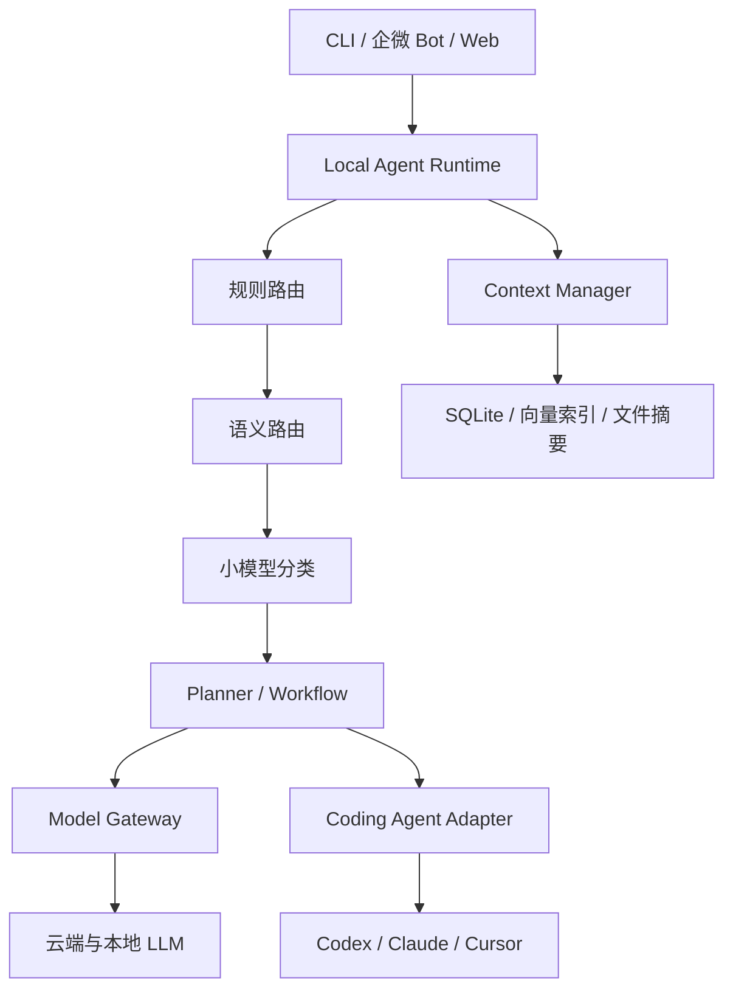

有成熟组件，但目前没有一个开源项目能同时把“意图识别、复杂度判断、模型路由、上下文压缩、本地缓存、Codex/Cursor/Claude 执行”全部做好。

你的场景最合理的方向不是再找一个“大而全机器人”，而是搭建一个供应商无关的本地 Agent Runtime：上层自己掌握任务、上下文和路由，下层把 Codex、Claude Code、Cursor、普通 LLM 都当作可替换执行器。

## 推荐结论

基于你已有的 AAFE/Node/TypeScript 技术方向，我建议采用：

| 层级           | 推荐方案                              | 主要职责                             |
| ------------ | --------------------------------- | -------------------------------- |
| 本地控制层        | 自研 TypeScript Runtime             | 会话、任务、权限、调度、执行状态                 |
| 工作流编排        | LangGraph.js 或轻量自研状态机             | 任务分解、暂停、恢复、重试                    |
| 意图路由         | Semantic Router 思路 + 本地 Embedding | 尽量零 LLM Token 完成一级分类             |
| 模型网关         | LiteLLM Proxy                     | 统一接入不同模型、限额、降级、缓存                |
| Coding Agent | Adapter 层                         | Codex、Claude Code、Cursor、Aider 等 |
| 上下文存储        | SQLite + 文件对象存储                   | 会话、摘要、任务、代码索引、调用记录               |
| 语义检索         | SQLite-vec/Qdrant                 | 只召回当前任务需要的内容                     |
| 观测评测         | Langfuse + 自建路由评测集                | Token、成本、耗时、分类准确率                |

核心组合：

> TypeScript Runtime + LiteLLM + 本地语义路由 + SQLite + Coding Agent Adapters

如果希望尽快形成 MVP，可以使用：

> LangGraph.js + LiteLLM + Semantic Router 独立服务 + SQLite

LangGraph 已经提供线程级状态、长期记忆、消息裁剪和摘要能力，适合处理可暂停恢复的工作流。[LangGraph Memory 文档](https://langchain-ai.github.io/langgraph/how-tos/persistence/)

---

## 不建议直接把 Cursor、Codex、Claude 当成“模型”

这里需要明确区分两种能力。

### 普通模型

例如：

* OpenAI API
* Anthropic API
* DeepSeek
* Qwen
* Kimi
* Gemini
* Ollama/vLLM 本地模型

它们适合统一放在 `ModelProvider` 后面。

### Coding Agent

例如：

* Codex
* Claude Code
* Cursor Agent
* Aider
* OpenHands

这些不是简单的 Chat Completion 模型，而是具备文件访问、Shell、MCP、Git、上下文收集和 Agent Loop 的完整执行环境。

应该定义另一套接口：

```ts
export interface CodingAgentAdapter {
  readonly name: string;

  capabilities(): Promise<AgentCapabilities>;

  start(input: AgentTask): Promise<AgentSession>;

  resume(
    sessionId: string,
    input: AgentContinuation,
  ): Promise<AgentSession>;

  cancel(sessionId: string): Promise<void>;

  stream(
    sessionId: string,
  ): AsyncIterable<AgentEvent>;
}
```

然后分别实现：

```text
CodexAdapter
ClaudeCodeAdapter
CursorAdapter
AiderAdapter
OpenHandsAdapter
```

这能避免整个系统被某个厂商 SDK 绑定。

---

## 整体架构



注意路由顺序不是每次都调用一个 LLM：

```text
规则命中
  ↓ 未命中
Embedding 语义路由
  ↓ 低置信度
小模型结构化分类
  ↓ 复杂或高风险
强模型复核
```

这会比“每条消息都把完整对话交给 Cursor 判断”节省大量 Token。

---

# 一、意图识别应该分层，不要一次识别所有东西

Cursor SDK 版本意图识别差，通常是因为一个 Prompt 同时承担了：

* 判断是不是新任务
* 判断任务类型
* 判断是否引用已有任务
* 判断复杂度
* 选择模型
* 选择工具
* 生成执行计划
* 生成回复

这是一个耦合度极高的分类任务。

建议拆成五个独立字段：

```ts
interface RouteDecision {
  relation: "new" | "continue" | "clarify" | "cancel";
  domain:
    | "chat"
    | "coding"
    | "analysis"
    | "research"
    | "document"
    | "operation";
  action:
    | "answer"
    | "inspect"
    | "plan"
    | "implement"
    | "test"
    | "review"
    | "deploy";
  complexity: "L0" | "L1" | "L2" | "L3";
  risk: "low" | "medium" | "high";
  confidence: number;
  targetTaskId?: string;
}
```

### 第一层：确定性规则

不调用模型：

* `/new`、`/cancel`、`/continue`
* 用户回复某个任务卡片
* 明确携带 `taskId`
* “停止刚才任务”
* 文件扩展名、仓库路径、PR 链接
* 明确关键词：实现、分析、测试、部署
* 当前线程是否存在唯一活跃任务

### 第二层：Embedding 语义路由

使用本地小型 Embedding 模型，将请求匹配到：

* coding.fix
* coding.review
* coding.architecture
* research
* document
* casual
* continuation
* task-control

Semantic Router 就是专门解决这种问题的，可以完全本地运行，并支持 Hugging Face Encoder、阈值优化和路由持久化。[Semantic Router GitHub](https://github.com/aurelio-labs/semantic-router)

这一层不需要生成 Token，成本和延迟都远低于 LLM 分类。

### 第三层：小模型分类

只有语义路由置信度不足时才调用：

* 本地 Qwen 小模型
* DeepSeek 小模型
* Gemini Flash 一类低成本模型

强制输出 JSON Schema，不允许输出推理文本。

### 第四层：强模型复核

只用于：

* 跨任务引用不明确
* 高风险命令
* 多仓库修改
* 架构设计
* 生产部署
* 大范围重构

---

# 二、复杂度和模型路由不要只靠“意图”

建议使用评分模型：

```ts
interface ComplexityFeatures {
  estimatedFiles: number;
  contextBytes: number;
  requiresPlanning: boolean;
  requiresTools: boolean;
  requiresCodeExecution: boolean;
  requiresRepositorySearch: boolean;
  crossModule: boolean;
  destructiveRisk: boolean;
  ambiguity: number;
}
```

例如：

```ts
score =
  estimatedFiles * 2 +
  Number(requiresPlanning) * 3 +
  Number(requiresCodeExecution) * 2 +
  Number(crossModule) * 4 +
  Number(destructiveRisk) * 5 +
  ambiguity * 3;
```

| 等级 | 任务示例              | 路由                     |
| -- | ----------------- | ---------------------- |
| L0 | 格式转换、简单问答、命令解释    | 本地模型/廉价模型              |
| L1 | 单文件修改、普通代码解释      | 快速 Coding 模型           |
| L2 | 多文件功能、Bug 定位、测试生成 | 中高能力模型                 |
| L3 | 架构重构、跨仓库、高风险操作    | 强模型 + Planner + Review |

不要直接配置“代码任务全部 Claude，分析任务全部 Codex”。应该配置候选模型能力：

```json
{
  "models": {
    "fast-code": {
      "capabilities": ["coding", "tool_call"],
      "maxComplexity": "L1",
      "priority": 10
    },
    "deep-code": {
      "capabilities": ["coding", "planning", "large_context"],
      "maxComplexity": "L3",
      "priority": 30
    }
  }
}
```

路由器根据以下条件计算：

```text
能力匹配
+ 任务复杂度
+ 历史成功率
+ 当前可用性
+ 预计成本
+ 首 Token 延迟
+ 上下文容量
+ 用户偏好
```

---

# 三、模型统一接入：LiteLLM 比自己封装几十个 SDK 更合适

LiteLLM 提供统一的 OpenAI-compatible 接口，可以接入大量模型供应商，也支持：

* 重试
* fallback
* timeout
* cooldown
* 负载均衡
* 成本统计
* 调用预算
* 响应缓存
* Provider 统一异常

官方仓库目前将其定位为支持 100+ Provider 的开源 AI Gateway。[LiteLLM GitHub](https://github.com/BerriAI/litellm)

它的 Router 主要解决部署级路由、重试、冷却和故障降级，而不是替你判断业务意图。[LiteLLM Router 文档](https://docs.litellm.ai/docs/routing)

因此正确分工是：

```text
你的 Policy Router
决定：这个任务应该用什么能力等级

LiteLLM
决定：该模型对应哪个 Provider、实例、fallback
```

例如：

```yaml
model_list:
  - model_name: local-fast
    litellm_params:
      model: openai/qwen-local
      api_base: http://localhost:11434/v1

  - model_name: coding-medium
    litellm_params:
      model: anthropic/claude-sonnet

  - model_name: reasoning-strong
    litellm_params:
      model: openai/your-strong-model
```

LiteLLM 也支持响应缓存、预算和 Agent 迭代次数限制，可用于阻止失控循环。[缓存文档](https://docs.litellm.ai/docs/proxy/caching)、[Agent 预算文档](https://docs.litellm.ai/docs/a2a_iteration_budgets)

但是不要完全依赖“相同 Prompt 响应缓存”，代码 Agent 场景命中率通常不高。更重要的是缓存：

* 路由结果
* 文件摘要
* 仓库结构
* AST 分析结果
* Git diff 分析
* 工具调用结果
* Embedding
* 已完成任务的结构化结论

---

# 四、上下文压缩应该采用分层存储

不要把聊天记录当作唯一上下文。

建议拆成：

```ts
interface TaskContext {
  taskSnapshot: TaskSnapshot;
  workingMemory: WorkingMemory;
  retrievedMemories: MemoryItem[];
  repositoryContext: RepositoryContext;
  recentMessages: Message[];
}
```

## 建议保存的四层上下文

| 层级   | 内容             | 是否直接发送模型 |
| ---- | -------------- | -------- |
| 原始事件 | 所有消息、工具输出、日志   | 默认不发送    |
| 当前窗口 | 最近几轮有效交互       | 是        |
| 任务快照 | 目标、约束、决策、进度、待办 | 是        |
| 长期记忆 | 用户偏好、项目知识、历史结论 | 按需检索     |

`taskSnapshot` 比自然语言摘要更重要：

```json
{
  "goal": "修复登录后的白屏问题",
  "constraints": [
    "不能修改SSO服务",
    "保持Vue2兼容"
  ],
  "decisions": [
    "先检查路由守卫"
  ],
  "completed": [
    "复现问题",
    "确认token存在"
  ],
  "pending": [
    "检查动态路由注入"
  ],
  "touchedFiles": [
    "src/router/index.ts"
  ]
}
```

每次只发送：

```text
System Instructions
+ Task Snapshot
+ 当前 Git Diff
+ 检索到的相关文件
+ 最近 4～8 条消息
```

而不是整个历史会话。

## 本地复用的缓存键

```text
route:
  hash(normalized_request + active_task_state)

file-summary:
  hash(file_content + summary_schema_version)

repo-map:
  hash(git_commit + config)

analysis:
  hash(diff + analyzer_version)

prompt:
  hash(system_prompt + stable_context + model_family)
```

当工作区代码改变时，只失效受影响文件及其依赖节点，不要清空整个上下文缓存。

---

# 五、开源方案怎么选

| 方案                        | 适合程度 | 评价                                           |
| ------------------------- | ---: | -------------------------------------------- |
| LangGraph.js              |    高 | 适合状态化、可恢复工作流和上下文管理                           |
| LiteLLM                   |   很高 | 最适合作为多模型统一网关                                 |
| Semantic Router           |    高 | 适合低 Token 意图分类，但 Python 为主                   |
| Mastra                    |   中高 | TypeScript 友好、上手快，但不建议把底层协议绑死                |
| Microsoft Agent Framework |   中高 | 生产级编排、多 Provider、A2A/MCP，但主要是 Python/.NET/Go |
| AutoGen                   |    低 | 官方仓库已经说明进入维护模式，新项目不建议采用                      |
| Dify                      |    中 | 快速做通用 Bot 很方便，做深度本地 Coding Runtime 改造偏重      |
| OpenHands                 |    中 | 可作为 Coding Agent 执行器，不适合承担整个路由平台             |
| CrewAI                    |   中低 | 多角色演示简单，但任务状态、成本控制和确定性不足                     |
| Mem0/Graphiti             |   可选 | 长期记忆增强，不应该作为第一阶段核心依赖                         |

AutoGen 当前已经进入维护模式，官方建议新项目采用 Microsoft Agent Framework。[AutoGen GitHub](https://github.com/microsoft/autogen)
Microsoft Agent Framework 支持生产级 Agent 工作流、多 Provider、MCP/A2A 和可恢复执行，但如果 AAFE 主体是 TypeScript，接入成本会高于 LangGraph.js。[Microsoft Agent Framework](https://github.com/microsoft/agent-framework)

---

# 六、最适合你的落地方案

考虑你已经有 AAFE CLI，建议不要重新采用一个完整机器人平台覆盖它，而是把 AAFE 升级为：

```text
AAFE Agent Runtime
├── Task Manager
├── Context Manager
├── Intent Router
├── Complexity Evaluator
├── Model Policy Engine
├── Workflow Runtime
├── Model Gateway Client
├── Coding Agent Adapters
├── Tool/MCP Registry
└── Telemetry & Evaluation
```

配置拆分：

```text
.aafe/
├── agents.json
├── models.json
├── routing.json
├── context.json
├── permissions.json
└── runtime.db
```

Adapter 设计：

```ts
interface ExecutorAdapter {
  id: string;
  type: "llm" | "coding-agent" | "workflow";

  supports(capability: Capability): boolean;

  estimate(input: ExecutionInput): Promise<ExecutionEstimate>;

  execute(input: ExecutionInput): AsyncIterable<ExecutionEvent>;

  cancel(executionId: string): Promise<void>;
}
```

这样模型和 Agent 都可以注册：

```json
{
  "executors": [
    {
      "id": "codex",
      "type": "coding-agent",
      "adapter": "@aafe/adapter-codex"
    },
    {
      "id": "claude-code",
      "type": "coding-agent",
      "adapter": "@aafe/adapter-claude-code"
    },
    {
      "id": "cursor",
      "type": "coding-agent",
      "adapter": "@aafe/adapter-cursor"
    },
    {
      "id": "litellm",
      "type": "llm",
      "adapter": "@aafe/adapter-openai-compatible"
    }
  ]
}
```

## 推荐实施顺序

第一阶段先解决最烧 Token 的问题：

1. SQLite 任务状态。
2. 规则路由。
3. 本地 Embedding 语义路由。
4. 结构化 Task Snapshot。
5. 最近消息窗口限制。
6. 文件摘要和仓库地图缓存。
7. Token/成本/路由结果记录。

第二阶段再做多模型：

1. 部署 LiteLLM。
2. 建立模型能力注册表。
3. 配置复杂度阶梯。
4. 配置 fallback。
5. 记录每类任务的成功率。
6. 根据评测数据调整路由。

第三阶段接 Coding Agent：

1. Codex Adapter。
2. Claude Code Adapter。
3. Cursor Adapter。
4. 统一事件流、取消、恢复。
5. Git worktree 任务隔离。
6. 权限和高风险操作门禁。

## 最终建议

不要直接二次开发 Dify、OpenHands 或 AutoGen 来做整个系统。

你的最佳基线是：

> 保留 AAFE 作为主控制面，使用 LangGraph.js 管理工作流，LiteLLM 管理普通模型，借鉴 Semantic Router 实现本地意图识别，通过 Adapter 接入 Codex、Claude Code、Cursor 等完整 Coding Agent。

这套方案的关键价值是：以后更换任何一个模型、Agent 或网关，都不会影响任务、上下文和路由这三个最有价值的核心层。
